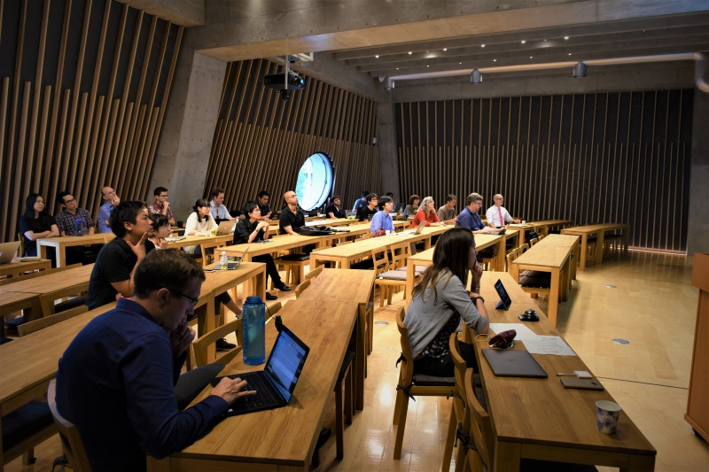
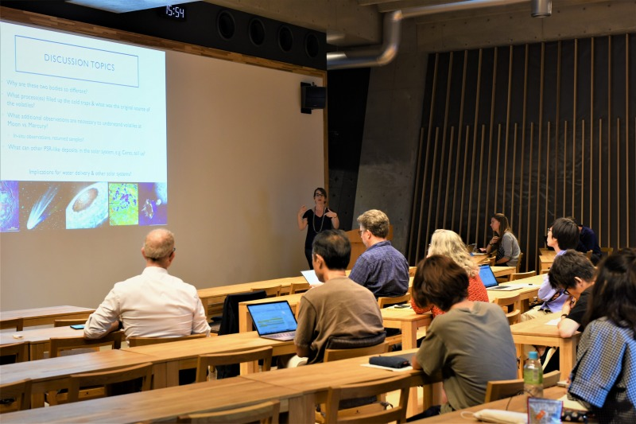
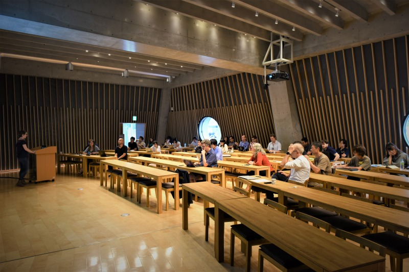
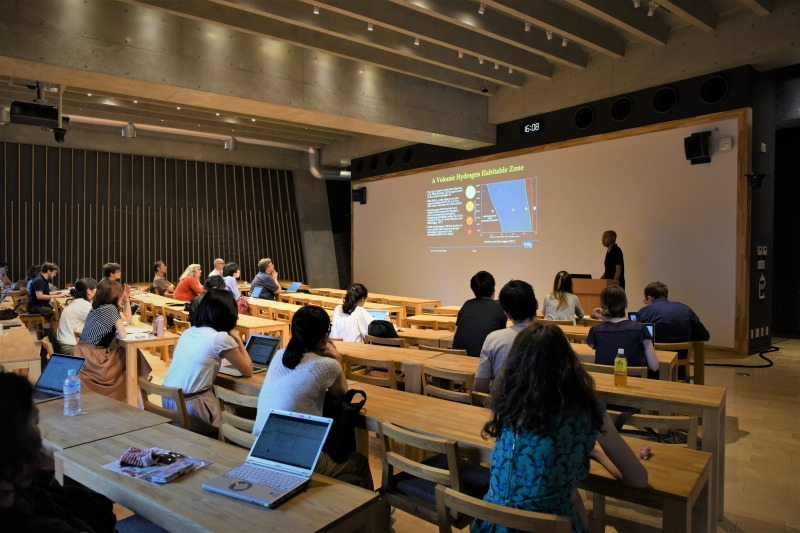

<!-- 
# 5th Tokyo Area Planetary Science (TAPS) meeting to be held at the University of Tokyo (Hongo campus) on June 10, 2019, 13:30-17:30
## [Registration Open](https://docs.google.com/forms/d/e/1FAIpQLSfRwIPFsXRHZEcWsZihy_jKtjF3v96vvAnC0Q1Zay3cLO0u1Q/viewform)
-->
<!-- # 6th Tokyo Area Planetary Science (TAPS) meeting to be held at [ELSI](http://elsi.jp/) on September 30, 2019, 13:30 - 17:30
## [Registration Open](https://docs.google.com/forms/d/e/1FAIpQLSfRwIPFsXRHZEcWsZihy_jKtjF3v96vvAnC0Q1Zay3cLO0u1Q/viewform)
### Speakers
- Guest talk by Erik Parker (NASA Goddard): “Oligopeptide formation under mild aqueous conditions”
- Keynote talk by Christine Houser (ELSI/Tokyo Tech): “Water’s journey through rocky planets”
- Masashi Omiya (Astrobiology Center): “IRD-SSP: Search for planets like Earth around late-M dwarfs”
- Aaron C. Bell (Ridge-i Inc./University of Tokyo): “EXO-ATMOS: A scalable grid of hypothetical planetary atmospheres”
- James O’Donoghue (JAXA): “Saturn’s Rings and Jupiter’s Great Red Spot: an animated discussion”
-->
# 7th Tokyo Area Planetary Science (TAPS) meeting to be held at [ISAS](http://www.isas.jaxa.jp/) on January 10, 2020, 14:00 - 17:00
## [Registration Open](https://docs.google.com/forms/d/e/1FAIpQLSd1GOfYgWtrIg7rxi6DsnBocXb7eMO_oNYA6Ce-czqEArZ3Cg/viewform)
### Speakers
- Keynote talk by Giovanna Tinetti (UCL): “ARIEL and TWINKLE: Exploring the atmospheres of exoplanets”
- Masashi Omiya (Astrobiology Center): “IRD-SSP: InfraRed Doppler with Subaru for discovering Earth-sized planets around late-M dwarfs”
- Hajime Kawahara (U. Tokyo): “REACH: Exoplanet characterisation with extremely high-contrast spectroscopy with Subaru”
- Go Murakami (ISAS, JAXA): “WSO-UV/UVSPEX: Characterising terrestrial planets in the UV”

---

We are a group of Tokyo-area astronomers, planetary scientists, and astrobiologists who gather semi-regularly to discuss a wide variety of planet-related topics. We welcome anyone working on planets, both in and out of the solar system, to join us!

---

東京近郊の天文学者・惑星科学者・宇宙生物学者が集まって惑星に関する様々な話題を話し合うためのグループです。太陽系内外に関わらず惑星に関わる研究をしている方ならどなたでもご参加ください！

---

## [Meetings](meetings)

---

## [Calendar](https://calendar.google.com/calendar/embed?src=a32qrv3tnpfk6riaih04b2imt0%40group.calendar.google.com&ctz=Asia%2FTokyo)

---

## [Mailing list](http://goo.gl/tLDPFM)

---

   

---

Harassment of any kind will not be tolerated. All event attendees and staff have the right to a space that is free of all forms of discrimination, harassment, bullying, and/or retaliation. Participants who are requested to stop any harassing behavior are expected to comply immediately. If you wish to report harassment, suspect that someone else is being harassed, or have any other concerns, please contact a member of the organizing committee as soon as possible.
